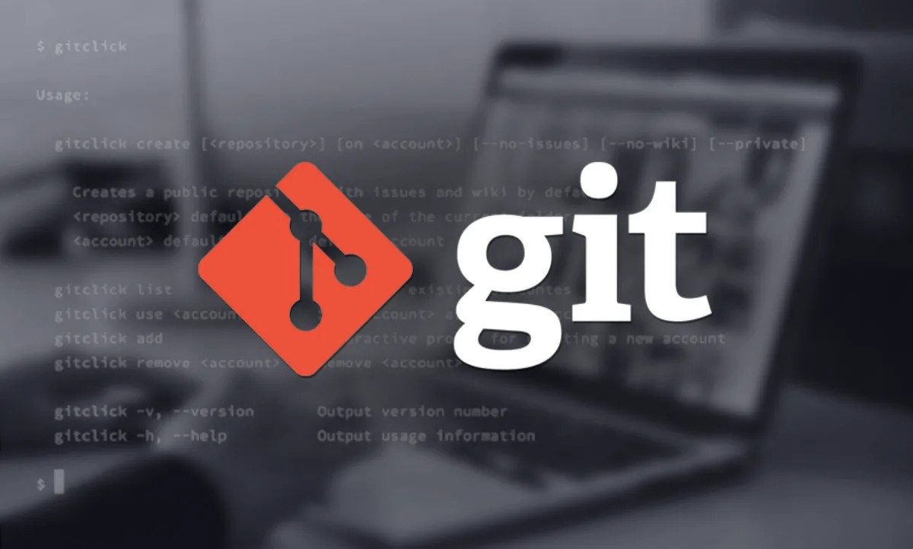

[ <назад](warpgit.md) [*содержание*](readme.md) [вперед>](installation.md)

## Преимущества Git
---
### Одновременная разработка
---
Каждый имеет собственную локальную копию кода и может одновременно работать в собственных ветвях. Git работает в автономном режиме, так как практически каждая операция является локальной.

### Встроенная интеграция
---
Из-за своей популярности Git интегрируется в большинство инструментов и продуктов. Каждая основная интегрированная среда разработки поддерживает встроенную Git, а многие средства поддерживают непрерывную интеграцию, непрерывное развертывание, автоматическое тестирование, отслеживание рабочих элементов, метрики и интеграцию функций создания отчетов с Git. Эта интеграция упрощает повседневный рабочий процесс.

### Сообщество поддержки
---
Git является открытым исходным кодом и стал де-факто стандартом для управления версиями. Нет недостатка в средствах и ресурсах, доступных командам для использования. Объем поддержки сообщества для Git по сравнению с другими системами управления версиями упрощает получение помощи при необходимости.

