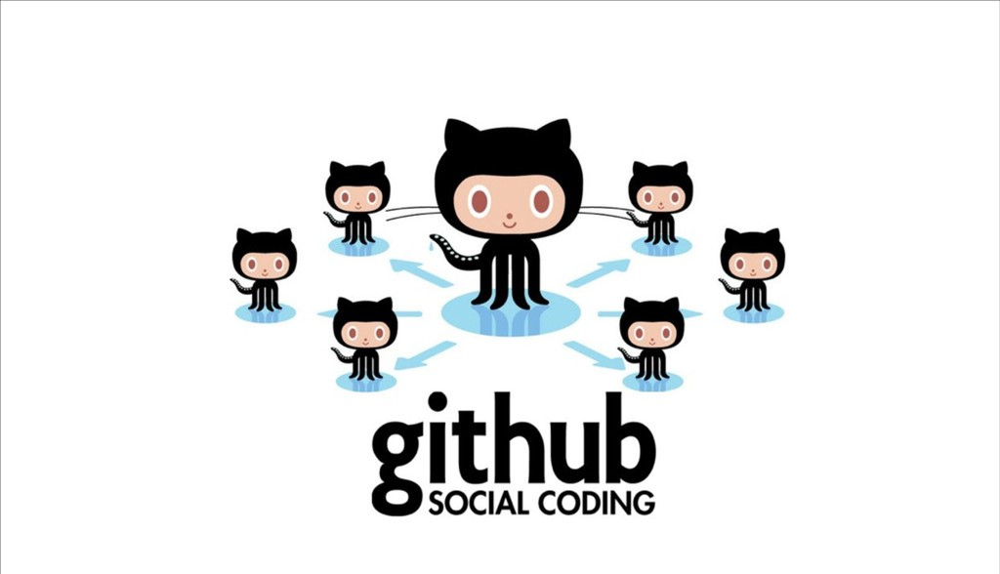

[<назад](github.md) [*содержание*](readme.md) [вперед>](gitandgithub.md)
## Преимущества GitHub
---
### Возможность совместной работы
---
Несколько разработчиков могут работать над одним проектом одновременно, что позволяет сократить время разработки и повысить качество кода.

### Удобное хранение и управление кодом
---
Все проекты хранятся в одном месте, что облегчает работу с ними и упрощает их управление.

### Отслеживание изменений
---
GitHub позволяет отслеживать все изменения, внесённые в проект, и возвращаться к предыдущим версиям кода в случае необходимости.

### Удобная система контроля версий
---
С помощью GitHub можно управлять версиями кода, вносить изменения и отслеживать их историю. 

### Разрешение конфликтов
---
При работе нескольких участников над одним и тем же файлом могут возникать конфликты. GitHub позволяет легко определить места расхождения и предоставляет инструменты для их урегулирования. 

### Интеграция с другими сервисами
---
GitHub отлично интегрируется с популярными инструментами разработчиков, такими как Jira, Slack и различные платформы для DevOps. 

### Простой и понятный интерфейс
---
GitHub предлагает удобный пользовательский интерфейс, который легко освоить даже новичкам.

